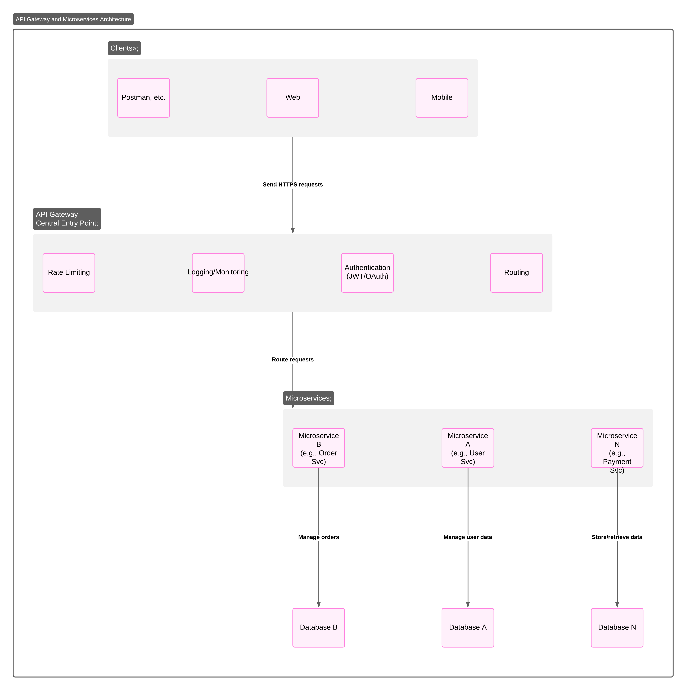

# API Gateway System Design

## Requirements
- Functional: Route requests, secure APIs.
- Non-Functional: Rate limit, low latency (<100ms).

## Architecture Diagram

## Components
- Client, API Gateway, Microservices, Database.

## Design Choices
- Spring Cloud Gateway: Routes and secures.
- Rate Limiting: Redis-based, 1000 req/min.
- Microservices: Modular design.

## Java Implementation
- Spring Security for auth.
- Spring Boot for microservices.
- Spring Data Redis for rate limiting.
