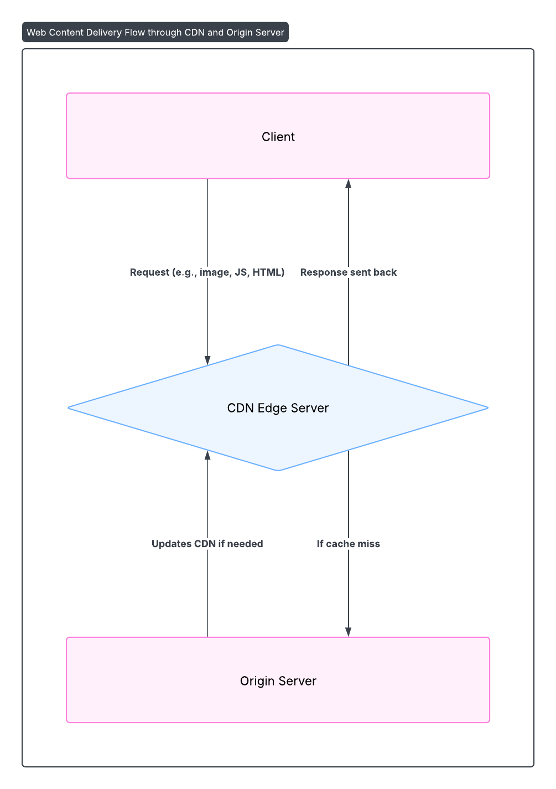

# CDN System Design

## Requirements
- Functional: Deliver content globally.
- Non-Functional: Reduce latency (<100ms), high traffic.

## Architecture Diagram

## Components
- Client, CDN Edge Servers, Origin Server, Cache.

## Design Choices
- Edge Servers: Global content delivery.
- Cache: TTL-based, 1 hour.
- Origin Server: Updates content.

## Java Implementation
- Spring Boot for Origin Server.
- Spring Cache for Edge caching.
- REST APIs for content.
