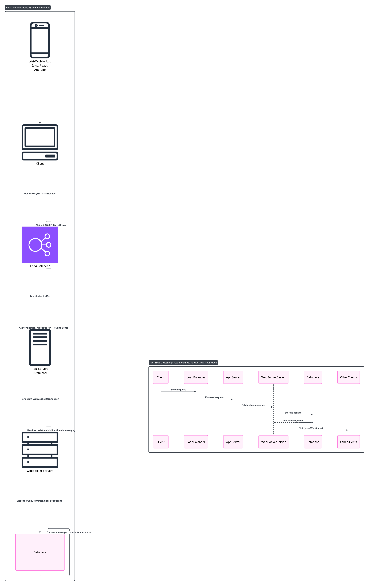

# Chat System Design

## Requirements
- Functional: Real-time messaging between users.
- Non-Functional: Low latency, scalable, reliable message delivery.

## Architecture Diagram and Message Flow Diagram

## Components

- **Client**: Sends/receives messages via WebSocket or HTTP.
- **Load Balancer**: Distributes incoming traffic.
- **App Servers**: Stateless services handling auth, REST APIs, WebSocket upgrades.
- **WebSocket Servers**: Manages real-time bi-directional communication.
- **Database**: Persists chat messages, metadata, user info.
