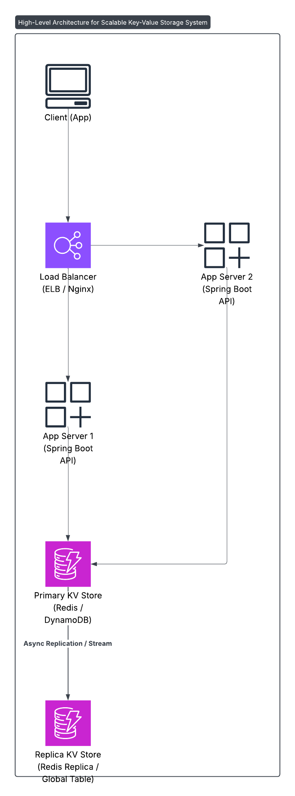

# Key-Value Store System Design

## Requirements
- Functional: Store/retrieve/update key-value pairs.
- Non-Functional: High throughput, low latency (<50ms), high availability.

## Architecture Diagram

## Components
- Client: Browser/app.
- Load Balancer: AWS ELB/Nginx.
- App Servers: Java/Spring Boot.
- Key-Value Store: Redis/DynamoDB (sharded).
- Secondary Nodes: Replicas for availability.

## Design Choices
- Redis: Low latency for in-memory storage.
- Sharding: By key hash for scalability.
- Replication: Ensures high availability.

## Java Implementation
- Spring Boot APIs (PUT /key/value, GET /key).
- Spring Data Redis, leveraging my Java experience.