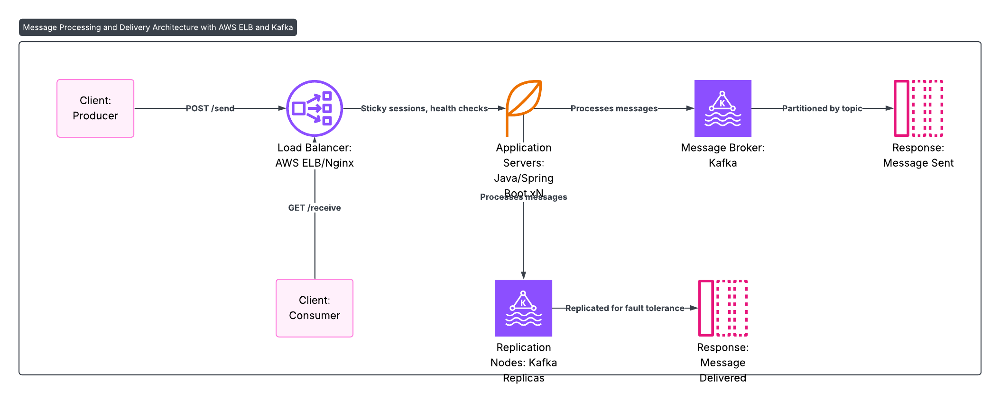

# Messaging System Design

## Requirements
- **Functional:** Send/receive messages, support queues/topics.
- **Non-Functional:** High throughput, low latency (<100ms), fault tolerance.

## Architecture Diagram

## Components
- **Client:** Producer/Consumer.
- **Load Balancer:** AWS ELB/Nginx.
- **App Servers:** Java/Spring Boot.
- **Message Broker:** Kafka/RabbitMQ (partitioned).
- **Replication Nodes:** For availability.

## Design Choices
- **Kafka:** High throughput for messaging.
- **Partitioning:** By topic for scalability.
- **Replication:** Ensures fault tolerance.
- **Sticky Sessions:** For consistent consumer routing.

## Java Implementation
- Use **Spring Kafka** or **Spring AMQP** for message handling.
- Expose **REST APIs** (`POST /send`, `GET /receive`) via Spring Boot.
- Leverages my **microservices experience**.
