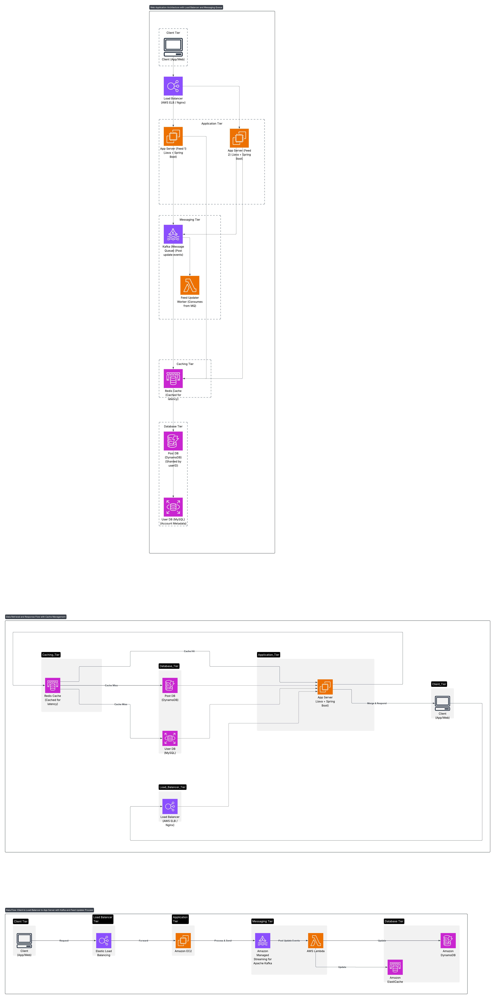

# News Feed System Design

## Requirements
- **Functional**: Display feed, post updates.
- **Non-Functional**: Low latency (<200ms), high throughput, scalability.

## Architecture Diagram

## Components
- **Client**: Mobile/Web interface.
- **Load Balancer**: AWS ELB / Nginx.
- **App Servers**: Java + Spring Boot.
- **Cache**: Redis (for frequently accessed feeds).
- **Database**: MySQL (User DB), DynamoDB (Posts) - sharded by user ID.
- **Message Queue**: Kafka for real-time post update events.

## Design Choices
- **Push Model**: Use Kafka to push post updates to followers’ feeds.
- **Caching**: Redis used for caching user feeds to reduce latency.
- **Sharding**: User data and posts sharded by user ID to improve scalability and reduce hotspots.

## Java Implementation
- **Spring Boot**: Used to develop RESTful feed APIs.
- **Spring Data Redis**: To store and retrieve cached feeds.
- **Spring Kafka**: To handle asynchronous post update events and fan-out feeds.