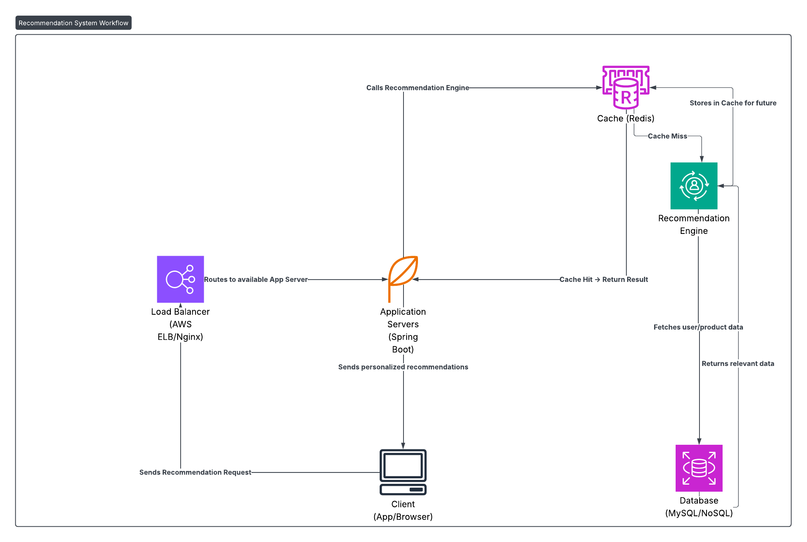

# Recommendation System Design

## Requirements
- Functional: Recommend products.
- Non-Functional: Low latency (<150ms), scalable.

## Architecture Diagram

## Components
- Client, Load Balancer, App Servers, Recommendation Engine, Cache, Database.

## Design Choices
- Caching: Redis for top recommendations.
- Sharding: Scales user data.
- ML Engine: Personalizes results.

## Java Implementation
- Spring Boot APIs.
- Spring Data Redis for caching.
- Custom ML integration.