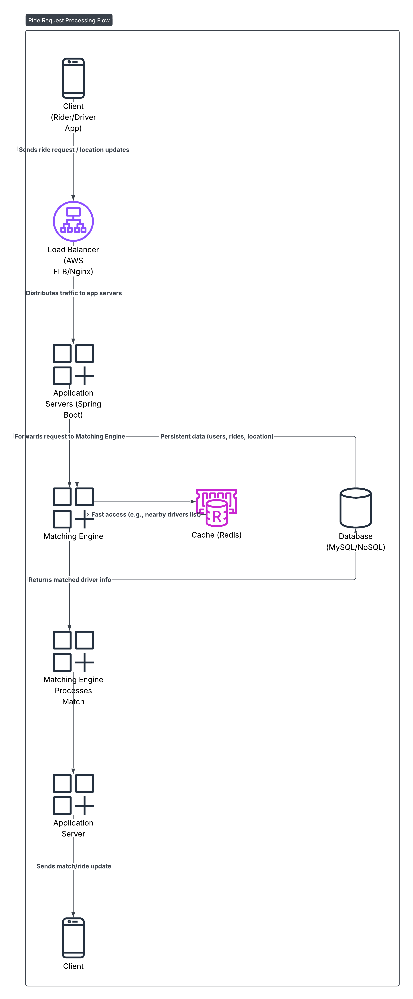

# Ride-Sharing System Design

## Scenario Setup

**Task**: Design a “Ride-Sharing System” (e.g., Uber).  
**Requirements**: Real-time matching, scalability, low latency.  
**Action Note**: *Ride-Sharing: Match riders/drivers, scalable.*

---

## Architecture Diagram

---

## Design Trade-Offs

### 1. **Latency vs. Consistency**
- For real-time matching, **low latency** is critical.
- We may allow **eventual consistency** (e.g., location updates) for speed.
- Use **caching** and **asynchronous writes** to DB for performance.

### 2. **Accuracy vs. Availability**
- A ride match might not be 100% optimal if done quickly.
- Prioritize fast matching and fallback to rerouting if needed.

### 3. **Read vs. Write Optimization**
- Frequent **reads** (get nearby drivers) → Optimize with **Redis**.
- High **write volume** (location updates, ride status) → Use **message queues** and **batching**.

### 4. **Horizontal Scaling vs. Strong Coordination**
- Scaling out matching engines requires strategies like **consistent hashing**.
- Avoid strong coordination (e.g., distributed locks) unless necessary.

### 5. **Cache Freshness vs. Speed**
- Cache may hold **slightly stale** driver locations.
- Acceptable trade-off for better performance.

---

## Summary

The ride-sharing system must prioritize **real-time performance** while maintaining an acceptable level of **consistency**. Smart use of **caching**, **asynchronous processing**, and **data partitioning** enables scalable and responsive user experiences.