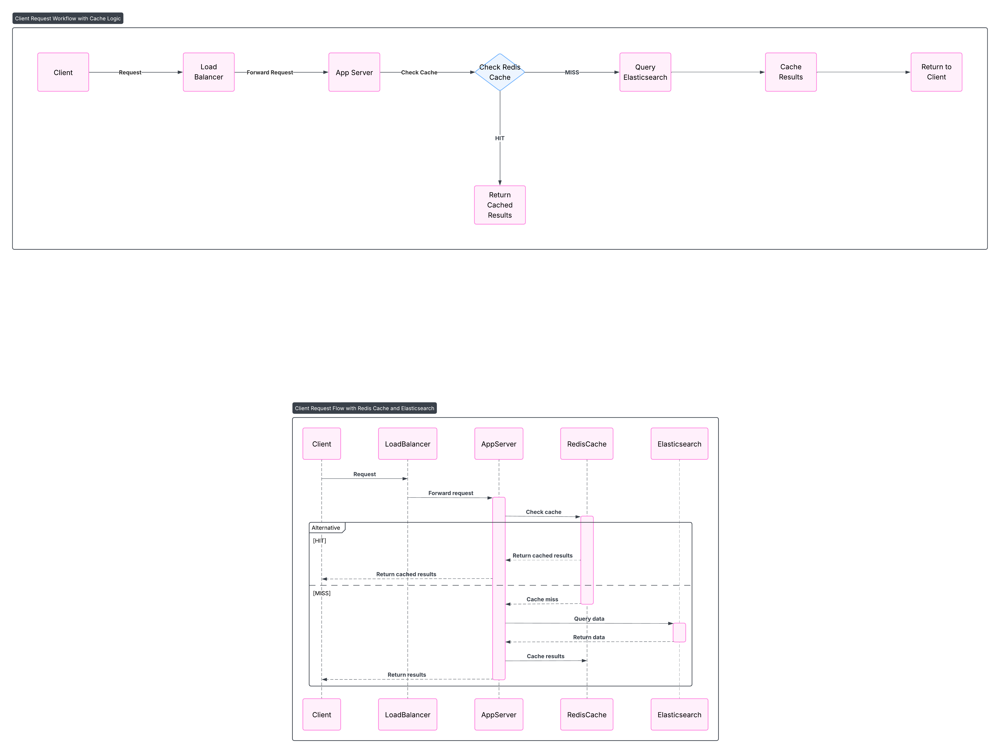

# Search Engine System Design

## Requirements
- Functional: Index, search, rank results.
- Non-Functional: Low latency (<200ms), high throughput, scalability.

## Architecture Diagram

## Components
- Client, Load Balancer, App Servers, Search Nodes, Cache, Database.

## Design Choices
- Elasticsearch: For indexing and ranking.
- Caching: Redis for top queries.
- Sharding: By keyword for scalability.

## Java Implementation
- Spring Boot APIs for search.
- Spring Data Elasticsearch for indexing.
- Spring Cache for results.
